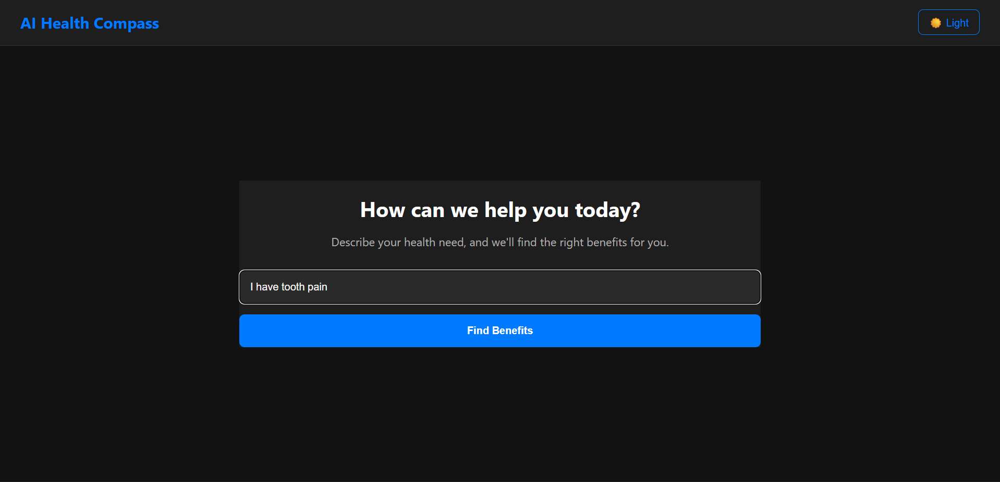

# AI Health Compass 

This project is an AI-powered, multi-screen web application designed to help employees discover company health benefits based on their needs. Users can describe their health issue in free text, and the application will classify the need, display relevant benefits (dynamically generated by AI), and generate a step-by-step action plan.

## 1. Project Setup & Demo

* **Technology Stack:** React, TypeScript, Vite, Zustand, Lottie, Axios, Flask (Python), Google Gemini AI
* **Hosted Demo Link:** [https://ai-health-compass.vercel.app/](https://ai-health-compass.vercel.app/)
* **GitHub Repository:** [https://github.com/Aisenh037/AI-Health-Compass.git](https://github.com/Aisenh037/AI-Health-Compass.git)
* **Backend API:** Deployed on Render (Flask + Gemini AI)

### Local Setup Instructions

To run this project locally, please follow these steps:

1.  **Clone the repository:**
    ```bash
    git clone https://github.com/Aisenh037/AI-Health-Compass.git
    ```

2.  **Navigate to the project directory:**
    ```bash
    cd AI-Health-Compass
    ```

3.  **Install frontend dependencies:**
    ```bash
    npm install
    ```

4.  **Install backend dependencies:**
    ```bash
    pip install -r requirements.txt
    ```

5.  **Set up environment variables:**
    - Create a `.env` file in the root directory
    - Add: `GEMINI_API_KEY=your_gemini_api_key_here`

6.  **Start the backend server:**
    ```bash
    python app.py
    ```
    The backend will run on `http://127.0.0.1:5000`.

7.  **Start the frontend development server:**
    ```bash
    npm run dev
    ```
    The application will be available at `http://localhost:5173`.

---

## 2. Problem Understanding

The goal of this project is to create a seamless, multi-screen experience for an employee to discover company health benefits. The flow allows a user to input a health-related need in free text, which is then classified by an AI into a relevant benefit category. The app then displays suitable benefits (dynamically generated by Google Gemini AI) and generates a simple, step-by-step action plan for the user's chosen benefit.

* **Assumptions:**
    * Benefit data is **dynamically generated** using Google Gemini AI via a Flask backend.
    * AI service calls are made to the backend API for real-time generation.

---

## 3. AI Integration & Prompts

The app integrates Google Gemini AI for dynamic content generation.

### Gemini Prompts

* **Benefit Generation:** `'Generate 3-5 employee health benefits for the category '{category}'. Each benefit should have: title, coverage, description. Return as JSON array.'`
* **Action Plan Generation:** `'Generate a simple 3-step action plan for an employee to avail the '{benefit_title}' benefit. Return as JSON array of strings.'`
* **Classification:** Uses regex-based classification (can be upgraded to AI in future).

### Fallback & Regeneration Logic

* **Fallback:** If AI generation fails, static mock data is used.
* **Dynamic Generation:** Benefits are generated on-demand for each category.

---

## 4. Architecture & State Management

* **Component Structure:** The application is divided into four main screens:
    * `BenefitInputScreen`: Contains the initial text input field.
    * `LoadingScreen`: Shows a Lottie animation while the AI classifies the input.
    * `BenefitListScreen`: Displays the AI-generated benefit cards that match the classified category.
    * `BenefitDetailsScreen`: Displays the final AI-generated 3-step action plan.
* **Navigation:** The flow between screens is managed in `App.tsx` using **conditional rendering** based on the `currentScreen` state.
* **Backend API:** Flask app (`app.py`) with endpoints for benefit generation using Gemini AI.
* **AI Service:** Frontend calls backend API for dynamic benefits; classification and action plans are handled in frontend.
* **State Management:** **Zustand** is used for centralized state management. The store (`appStore.ts`) provides a single source of truth for the application's state. Zustand's `persist` middleware saves state to `localStorage`.

---

## 5. Screenshots

**Screen 1: Free-Text Input**


**Screen 2: AI Classification & Loading**


**Screen 3: Benefit Cards Display**


**Screen 4: Generated Action Plan**


---

## 6. Deployment

* **Frontend:** Deployed on Vercel with Speed Insights for performance monitoring.
* **Backend:** Deployed on Render (free tier) with Gemini API integration.
* **Environment Variables:**
  - Frontend: `VITE_API_BASE_URL` (points to Render backend)
  - Backend: `GEMINI_API_KEY`

---

## 7. Known Issues & Potential Improvements

* **Known Issues:**
    * AI generation may occasionally fail; falls back to static data.
* **Potential Improvements:**
    * Move all AI logic to backend (classification, action plans).
    * Add user feedback collection for AI improvements.
    * Implement caching for generated benefits.

---

## 8. Bonus Features

* **Lottie Animations:** Sleek loading animations.
* **Dynamic AI-Generated Content:** Benefits created by Gemini AI.
* **Performance Monitoring:** Vercel Speed Insights integrated.
* **Robust Fallback:** Clear error states with retry options.
